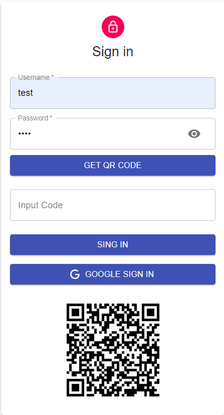
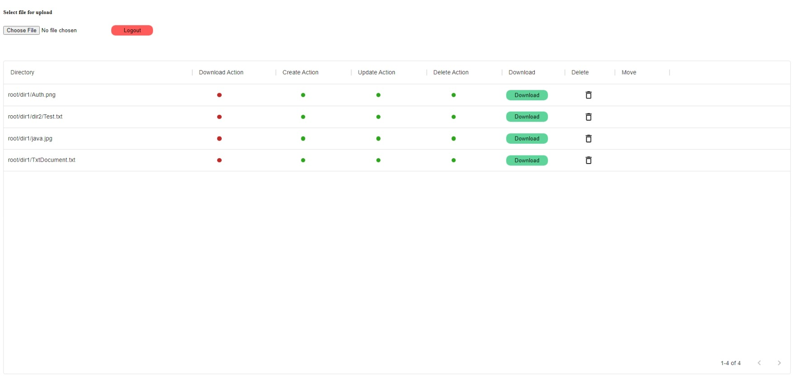
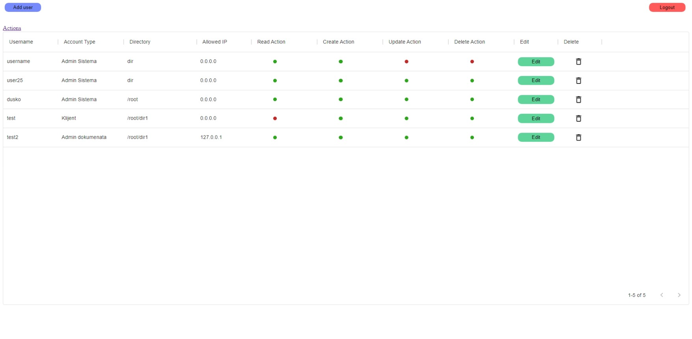
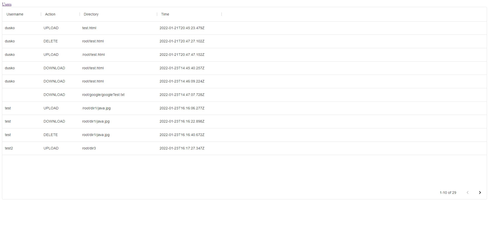

# DocumentsApp

## Table of contents
* [General info](#general-info)
* [Technologies](#technologies)
* [Setup](#setup)
* [Features](#features)
* [Screenshots](#screenshots)

## General info
This project is web application for file management and user management. Client is web application for Administrator and Client2 is for normal users. Admin can create, delete and
update user accounts and provide them with their root directory and privileges.Both applications are using two factor authorization with Google authenticator QR code.
	
## Technologies
Project is created with:
* Node.js
* React
* MongoDB

## Features
- 2FA
- download files from server
- upload files on server
- delete files
	
## Setup
To run this project, install server, client and client2 locally using npm:

```
$ cd /server
$ npm install
$ npm start

$ cd /client
$ npm install
$ npm start

$ cd /client2
$ npm install
$ npm start
```

## Screenshots




